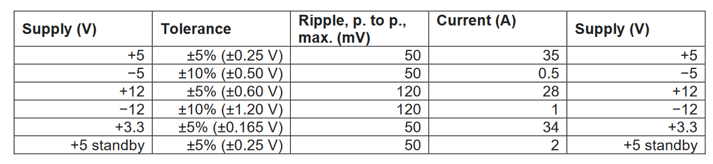

ATX_PowerSupply

Table of Contents
- [1. Overall Specifications for Power Supply](#1-overall-specifications-for-power-supply)
- [2. Stage 1: Boost Converter](#2-stage-1-boost-converter)
  - [2.1. Specifications](#21-specifications)
  - [2.2. Component Values](#22-component-values)
  - [2.3. Open Loop Simulations on LTSpice](#23-open-loop-simulations-on-ltspice)

# 1. Overall Specifications for Power Supply

- Work for mains inputs 100-250V, 50-60Hz
- Power rails: -5, +5, -12, +12, +3.3
  - 5V on whenevr mains is plugged in, others on when the computer power switch is pressed.
  - Ripple current and tolerance for supply voltage specified in table 1.
- Main Stages
  1. Boost converter
  2. Power factor correction stage (ensures that the current waveform pulled from the mains is in phase with, and the same shape as, the voltage waveform)
  3. Flyback converter with multiple secondary windings on the high frequency transformer to generate multiple voltage rails.

# 2. Stage 1: Boost Converter

## 2.1. Specifications

- $V_{in}$ Input voltage: 100 V to 350 V (wide input range that will later correspond to operation with different mains voltages).
- $V_{out}$ Output voltage: Fixed at 400 V (+/- 10 V which includes ripple voltage).
- $I_{out, max}$ Maximum output current: Set by ATX supply rail requirements in table 1.
- $\Delta I_{in}$ Input (Inductor) Current ripple: max 7.5% at maximum output power.
- $f_s$ Switching frequency : > 50 kHz.
- Efficiency > 93% at full load (to have a chance to meet the 85% overall efficiency
requirement)

## 2.2. Component Values

1. Inductor sizing: minimum inductor value as a function of $I_{in}$, $V_{in}$, $\delta$, $f_s$.

    $\Delta i_L = \frac{V_{in}}{{L}} t_{on} = \frac{V_{in}}{{L}} \frac{\delta}{f_s}$

    $L = V_{in} \Delta i_L \frac{\delta}{f_s}$

    $L = 2 V_{in} I_{in} \frac{\delta}{f_s}$ because at critical conduction $I_{in} = \frac{1}{2} \Delta i_L$

2. Peak and RMS inductor currents
   1. Peak inductor current in steady state, CCM

        $I_p = I_{in} + \frac{1}{2} \Delta i_L$

        > Don't I need the input or output current value for this?

   2. RMS (average) inductor current in steady state
   
        $I_{RMS} = \frac{I_P}{\sqrt{2}}$

   3. Inductor core size

        $L = \frac{N^2 \mu A}{l}$

   4. Why is this (peak and RMS current) important?

        By definition the average input current is the average inductor current. The inductor will need to handle the peak and RMS currents over the full range of $V_{in}$ and $V_{out}$, at the specified switching frequency. The higher the ripple (irrelevant to the average value), the higher the RMS value, which means more heating. 

3. Capacitor sizing: as a function of $\delta$, $f_s$, $I_{out}$ (Load current), $\Delta V_{ESR}$ voltage ripple.
        
    $C = \frac{\delta I_{out}}{f_s \Delta v_c}$

4. Switch and diode selection: Maximum current and voltage blocking capability for switch and diode.
   1. Maximum voltage blocking capability: Both $V_{max} = V_{out}$.
      1. For the MOSFET: When the MOSFET is OFF,  it is held at $V_{out}$ (plus a small diode drop).
      2. For the diode: When the MOSFET is ON, the positive terminal is held at a value near ground, and the negative terminal is held at $V_{out}$.
   2. Maximum current blocking capability: $I_{max} = I_{in} + \frac{1}{2} \Delta i_L$
        - In both cases, the device will have to block the maximum inductor current since that is the input current.

## 2.3. Open Loop Simulations on LTSpice

1. Efficiency in required range of operating conditions
2. Startup behaviour (assuming output capacitor and inductor are in a discharged state). Transfer function
   1. Percentage overshoot of output voltage
   2. Rise and settling time of output voltage
   3. Oscillation frequency of output voltage
3. Change in loads: very large and small loads (variation of output voltage w.r.t. fixed duty cycle). Stepped load changes between
   1. 50% load
   2. 100% load
4. How converter operates under very low loads.
